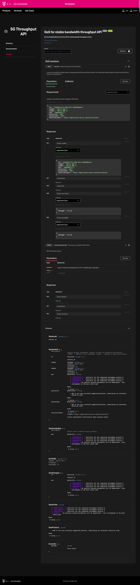
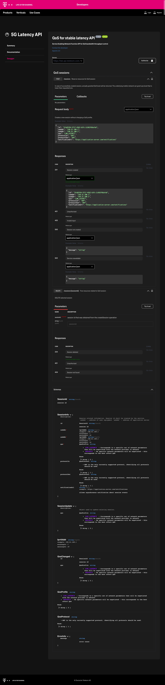

# TADhack 2022 in Berlin

Home of the TADHack Berlin location in 2022. Here we store general information things.

For connecting online, please use

+ [This Slack Workspace](https://join.slack.com/t/tads/shared_invite/zt-w2blauxi-KCawLDy0NV7mv063WOdUZA)
* and use the **tadhack-amsterdam-berlin-uk** channel

## Links to 5G API description

* 
    (Needs Postman registration)
* API Descriptions Screenshots
    -  - 

## hello

The script [hello](./hello) is using bash, imagemagick and pythons ppa6 to generat a 'hello my name is badge'. 

# Feedback

Any feedback is appreciated:

* developers@telekom.de
* [issues](https://github.com/dt-developers/tadhack-2022/issues)
